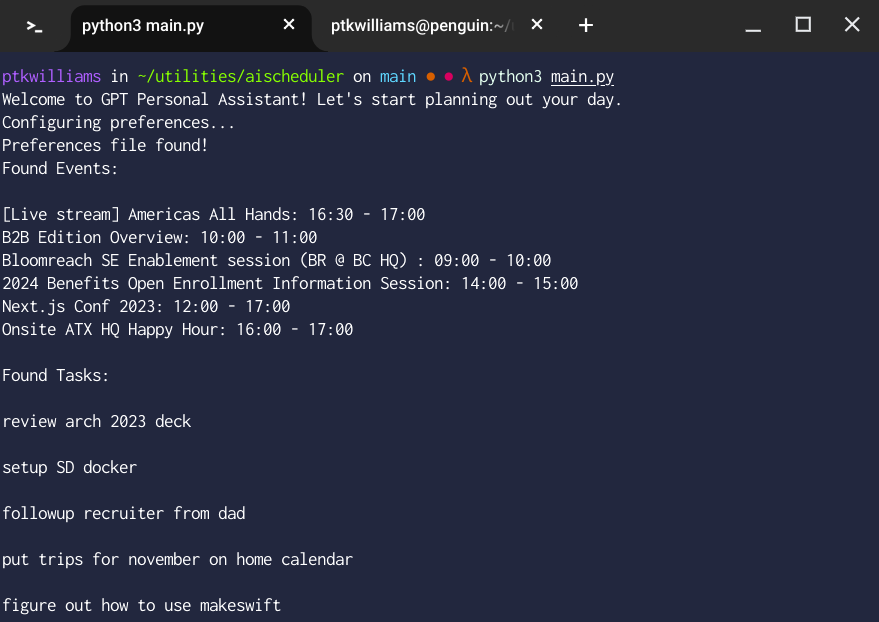
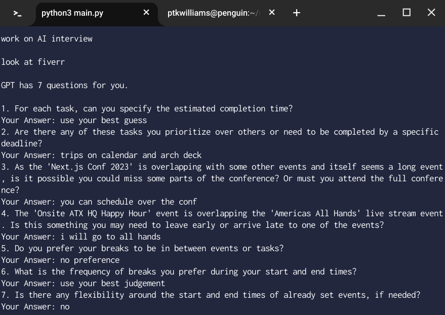
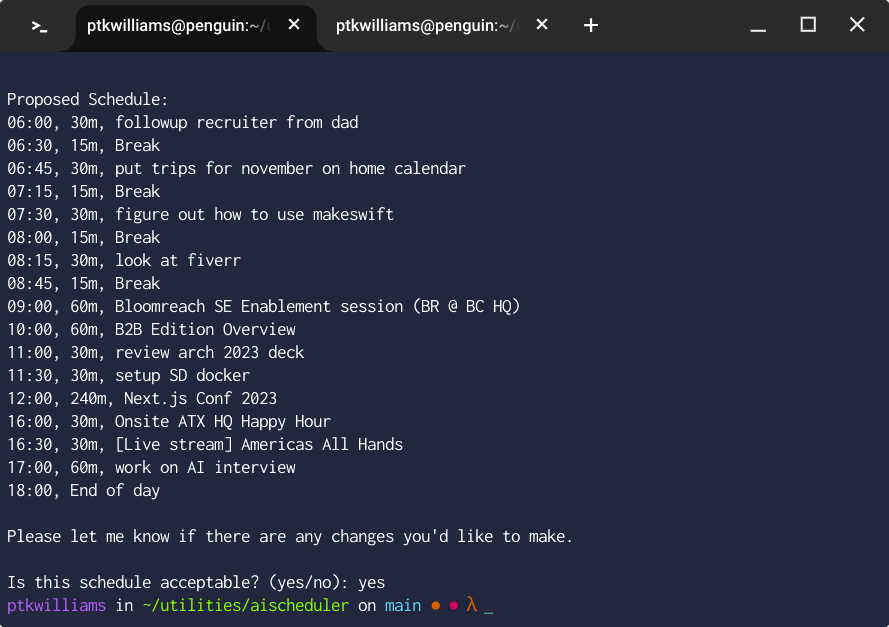
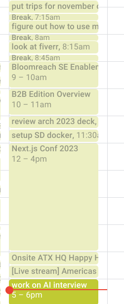

# GPT Personal Assistant

GPT Personal Assistant is a Python-based intelligent assistant that helps manage your daily schedule. By integrating with your local or remote ICS file for calendar events and a text file for tasks, it generates a personalized daily schedule that aligns with your preferences and existing commitments. This interactive tool interacts with you to fine-tune the schedule, ensuring a productive and balanced day, with additional features like error handling and user feedback loops for schedule optimization.

## Features

- **Calendar Integration**: Syncs with your local or remote ICS file to understand your existing commitments.
- **Task Management**: Pulls tasks from a specified text file with each task on a new line to be scheduled in your day.
- **Interactive Scheduling**: Communicates with you to understand your preferences and adjusts the schedule accordingly. Asks clarifying questions when necessary to better arrange your day.
- **User Feedback Loop**: Collects feedback for further schedule adjustments to ensure the generated schedule meets your expectations.
- **Automatic ICS File Generation**: After confirming the schedule, it generates an updated ICS file which can be imported to any standard calendar application.
- **Flexible Configuration**: Allows you to set up initial preferences such as the location of calendar and task files, and your timezone.
- **Robust Error Handling**: Validates the format of generated schedule to prevent errors and ensure accurate ICS file creation.

## Usage

1. **Before Getting Started**
    - [Download your calendar ICS file.](https://support.google.com/calendar/answer/37111?hl=en) or use a remote ICS file URL.
    - [Make sure your OpenAI API key is exported as an env var `OPENAI_API_KEY`](https://help.openai.com/en/articles/5112595-best-practices-for-api-key-safety)
    - Create a txt file of your tasks, one task per line

2. **Configuration**: 
    - Run `python main.py` to setup initial preferences if it's your first time running the script.
    - Follow the prompts to specify the location of your local or remote calendar (ICS file) and task file (text file), as well as your timezone.

3. **Generating Schedule**:
    - Run `python main.py` to start the schedule generation process.
    - The program will interact with you to understand your preferences and arrange your tasks and breaks around your existing commitments.
    - Once you confirm the schedule, the program will generate an updated ICS file which you can import to your calendar application.

4. **Updating Tasks and Calendar**:
    - Update the specified task file and calendar file as needed.
    - Run `python main.py` again to generate a new schedule based on the updated information.

## Todos

- Implement feature to read ICS files from HTTPS sources. (Completed)
- Add preference to include or omit existing calendar events in the final schedule output. (Completed)
- Implement feature to specify the target day for schedule generation (today, tomorrow, or a specific date). (Completed)
- Create a user-friendly UI for a more engaging user experience.
- Enhance the AI's capability to provide more insightful suggestions and manage complex scheduling scenarios.
- Support integration with other task and calendar services.

## Contribution

Feel free to submit issues, feature requests, and pull requests on this repository.
